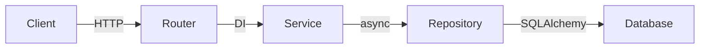

# FEAT-XXX Design: [Tên tính năng]

## Tổng quan

[1-2 câu: tính năng này hoạt động như thế nào về mặt kỹ thuật]

## Kiến trúc

## Data Models

### [Tên Model]

| Trường     | Kiểu     | Bắt buộc | Mặc định | Mô tả                     |
| ---------- | -------- | --------- | -------- | -------------------------- |
| id         | UUID     | tự động   | uuid4()  | Khoá chính                 |
| field_name | str      | có        | -        | Mô tả                     |
| created_at | datetime | tự động   | now(UTC) | Thời điểm tạo             |
| updated_at | datetime | tự động   | now(UTC) | Thời điểm cập nhật cuối   |

## API Endpoints

### POST /api/v1/[resource]

| Khía cạnh   | Chi tiết          |
| ------------ | ----------------- |
| Auth         | Bắt buộc (Bearer) |
| Request      | CreateSchema      |
| Response 201 | ResourceResponse  |
| Response 400 | ValidationError   |
| Response 401 | UnauthorizedError |

### GET /api/v1/[resource]/{id}

| Khía cạnh    | Chi tiết         |
| ------------ | ---------------- |
| Auth         | Bắt buộc         |
| Response 200 | ResourceResponse |
| Response 404 | NotFoundError    |

### GET /api/v1/[resource]?page=1&limit=20

| Khía cạnh    | Chi tiết                                           |
| ------------ | -------------------------------------------------- |
| Auth         | Bắt buộc                                           |
| Query Params | page (int, mặc định 1), limit (int, mặc định 20)  |
| Response 200 | PaginatedResponse[ResourceResponse]                |

### PUT /api/v1/[resource]/{id}

| Khía cạnh    | Chi tiết         |
| ------------ | ---------------- |
| Auth         | Bắt buộc         |
| Request      | UpdateSchema     |
| Response 200 | ResourceResponse |
| Response 404 | NotFoundError    |

### DELETE /api/v1/[resource]/{id}

| Khía cạnh    | Chi tiết      |
| ------------ | ------------- |
| Auth         | Bắt buộc      |
| Response 204 | Không có nội dung |
| Response 404 | NotFoundError |

## Kế hoạch file

| #   | File                                 | Hành động | Mô tả            |
| --- | ------------------------------------ | --------- | ----------------- |
| 1   | src/models/[resource].py             | CREATE    | SQLAlchemy model  |
| 2   | src/schemas/[resource].py            | CREATE    | Pydantic schemas  |
| 3   | src/repositories/[resource]\_repo.py | CREATE    | Truy cập dữ liệu |
| 4   | src/services/[resource]\_service.py  | CREATE    | Logic nghiệp vụ  |
| 5   | src/api/v1/routes/[resource].py      | CREATE    | API endpoints     |
| 6   | src/api/v1/router.py                 | MODIFY    | Đăng ký route     |

## Các task triển khai

### TASK-XXX: Models và Schemas (file 1-2)

- **Label: backend**
- Tạo model + Pydantic schemas
- Đọc: CONVENTIONS.md#python-models, #pydantic

### TASK-XXX: Repository (file 3)

- **Label: backend**
- Tạo async repository với các thao tác CRUD
- Đọc: src/repositories/base.py để tham khảo pattern

### TASK-XXX: Service Layer (file 4)

- **Label: backend**
- Tạo service với logic nghiệp vụ
- Đọc: output file của task 1 để lấy kiểu dữ liệu

### TASK-XXX: API Endpoints (file 5-6)

- **Label: backend**
- Tạo route handlers + đăng ký vào router
- Đọc: src/api/v1/routes/ để tham khảo pattern hiện có

<!-- Labels: backend | frontend | full-stack — PM sử dụng các label này để phân công task cho đúng agent Dev -->

## Quyết định thiết kế

- [Quyết định 1]: [Lý do]
- [Quyết định 2]: [Lý do]
