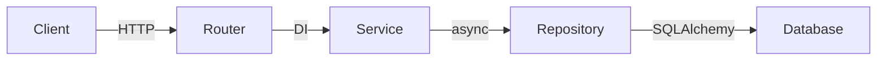

# FEAT-XXX Design: [Feature Name]

## Overview
[1-2 sentences: what this feature does technically]

## Architecture

## Data Models

### [ModelName]
| Field | Type | Required | Default | Description |
|-------|------|----------|---------|-------------|
| id | UUID | auto | uuid4() | Primary key |
| field_name | str | yes | - | Description |
| created_at | datetime | auto | utcnow() | Creation timestamp |
| updated_at | datetime | auto | utcnow() | Last update timestamp |

## API Endpoints

### POST /api/v1/[resource]
| Aspect | Detail |
|--------|--------|
| Auth | Required (Bearer) |
| Request | CreateSchema |
| Response 201 | ResourceResponse |
| Response 400 | ValidationError |
| Response 401 | UnauthorizedError |

### GET /api/v1/[resource]/{id}
| Aspect | Detail |
|--------|--------|
| Auth | Required |
| Response 200 | ResourceResponse |
| Response 404 | NotFoundError |

### GET /api/v1/[resource]?page=1&limit=20
| Aspect | Detail |
|--------|--------|
| Auth | Required |
| Query Params | page (int, default 1), limit (int, default 20) |
| Response 200 | PaginatedResponse[ResourceResponse] |

### PUT /api/v1/[resource]/{id}
| Aspect | Detail |
|--------|--------|
| Auth | Required |
| Request | UpdateSchema |
| Response 200 | ResourceResponse |
| Response 404 | NotFoundError |

### DELETE /api/v1/[resource]/{id}
| Aspect | Detail |
|--------|--------|
| Auth | Required |
| Response 204 | No content |
| Response 404 | NotFoundError |

## File Plan

| # | File | Action | Description |
|---|------|--------|-------------|
| 1 | src/models/[resource].py | CREATE | SQLAlchemy model |
| 2 | src/schemas/[resource].py | CREATE | Pydantic schemas |
| 3 | src/repositories/[resource]_repo.py | CREATE | Data access |
| 4 | src/services/[resource]_service.py | CREATE | Business logic |
| 5 | src/api/v1/routes/[resource].py | CREATE | API endpoints |
| 6 | src/api/v1/router.py | MODIFY | Register route |

## Implementation Tasks

### TASK-XXX: Models and Schemas (files 1-2)
- Create model + Pydantic schemas
- Read: CONVENTIONS.md#python-models, #pydantic

### TASK-XXX: Repository (file 3)
- Create async repository with CRUD operations
- Read: src/repositories/base.py for pattern

### TASK-XXX: Service Layer (file 4)
- Create service with business logic
- Read: task 1 output files for types

### TASK-XXX: API Endpoints (files 5-6)
- Create route handlers + register in router
- Read: src/api/v1/routes/ for existing patterns

## Design Decisions
- [Decision 1]: [Rationale]
- [Decision 2]: [Rationale]
